# 🛰️ Learning Nmap – Network Scanning & Mapping Lab

### 🎯 Objective
To perform **network reconnaissance, port scanning, live monitoring, and packet analysis** using tools like Nmap, Netstat, Tcpdump, Wireshark, and Scapy — all within a **Docker-based Kali Linux environment**.  
This lab demonstrates an end-to-end workflow of scanning, capturing, and analyzing packets as part of practical cybersecurity training.

---

## 🧰 Tools & Technologies

| Tool | Purpose |
|------|----------|
| **Docker** | Provides an isolated, safe lab for network testing |
| **Nmap** | Performs host discovery, service detection, and port enumeration |
| **Netstat** | Displays live connections and listening ports |
| **Netcat (nc)** | Opens sockets to test connectivity |
| **Tcpdump** | Captures packets directly from the network interface |
| **Wireshark** | Analyzes captured packets graphically |
| **Scapy (Python)** | Crafts custom packets and simulates controlled attacks |

---

## 🧪 Step-by-Step Lab Demonstration

### 1️⃣ Docker Lab Setup
A **custom Kali Linux image** was built with Python and Scapy pre-installed to enable network testing.

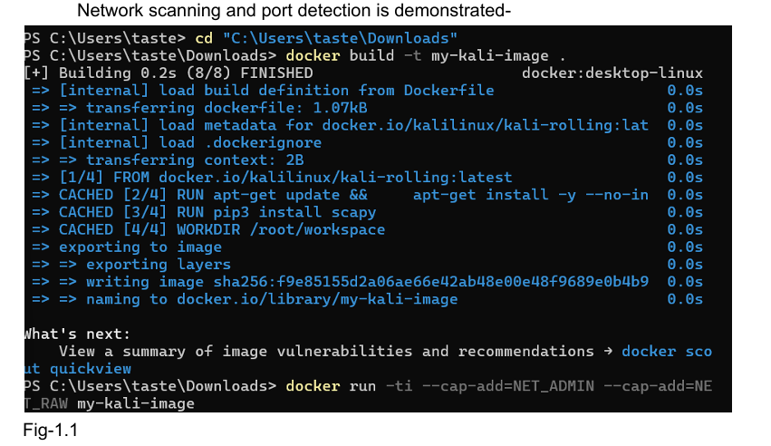  
*Fig-1.1 Building the Docker image environment*

---

### 2️⃣ Network Scanning with Nmap
Executed:
```bash
nmap -sV 127.0.0.1 -oN /root/workspace/nmap_output.txt
````

Detected localhost with all 1000 ports closed, confirming host reachability and secure configuration.

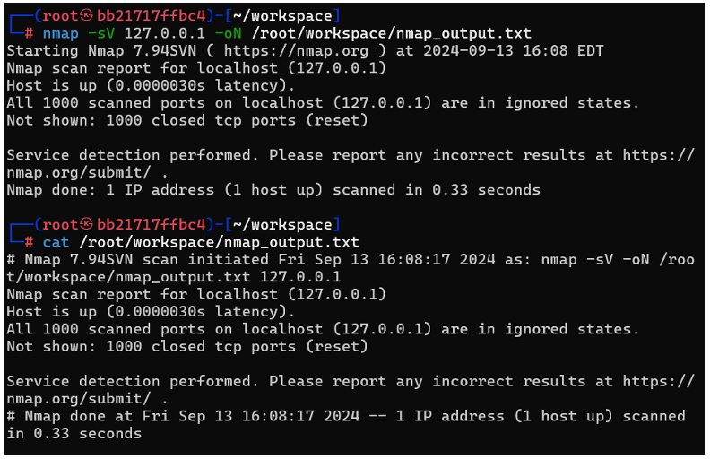
*Fig-1.2 Port and service detection using Nmap*

---

### 3️⃣ Connection Monitoring using Netstat & Netcat

Observed open and listening connections within the container using:

```bash
netstat -anp
nc -lvp 4444
curl http://www.example.com
```

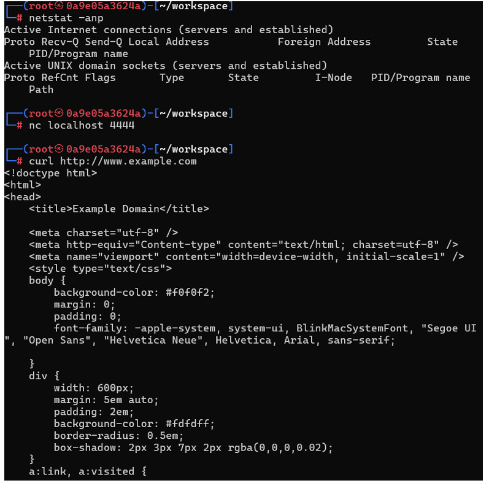
*Fig-2.1 Active TCP/UDP connections and socket states*

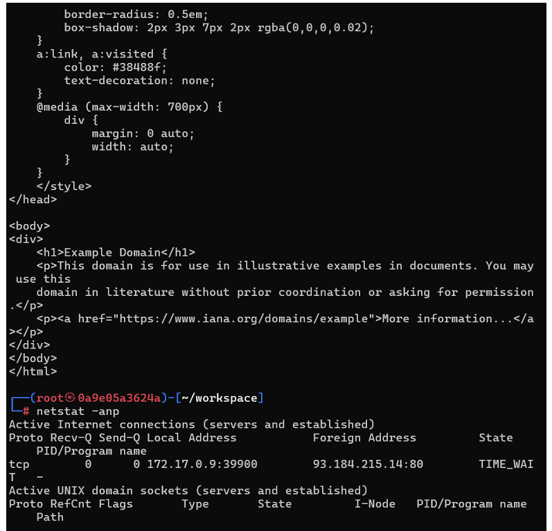
*Fig-2.2 Fetching webpage content to generate live traffic*

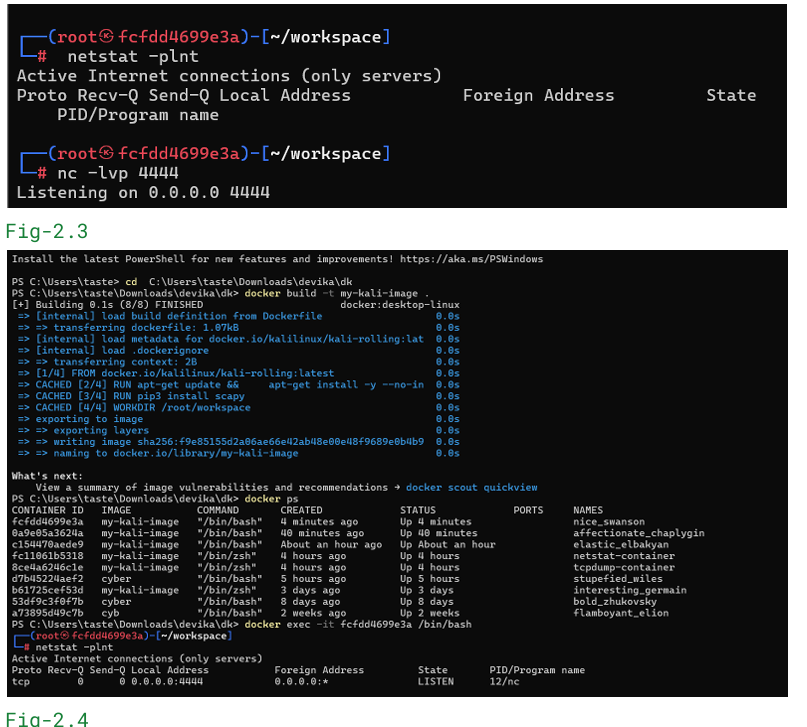
*Fig-2.3–2.4 Listener setup verification using Netcat*

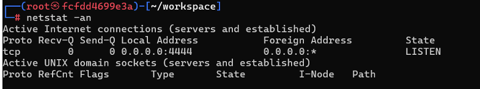
*Fig-2.5 Validating the active listener on port 4444*

---

### 4️⃣ Capturing Live Traffic with Tcpdump

Captured packets using:

```bash
tcpdump -i eth0 -w /root/workspace/tcpdump_output.pcap
```

Triggered live ICMP traffic via ping:

```bash
ping google.com
```

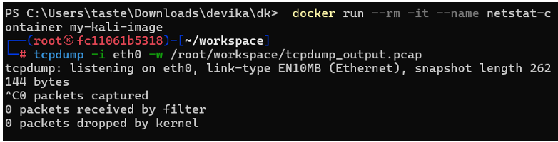
*Fig-4.1 Tcpdump initialized to record network traffic*

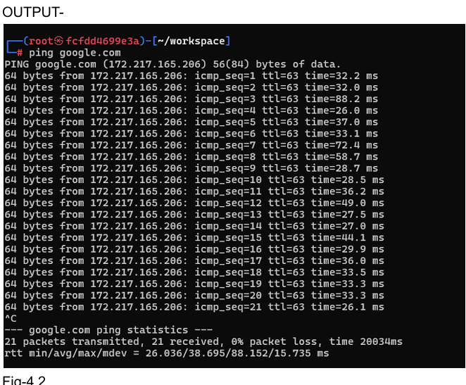
*Fig-4.2 ICMP request/reply during active ping*

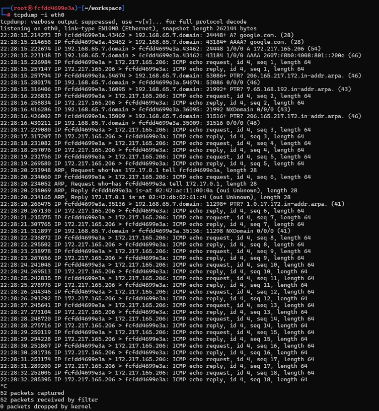
*Fig-4.3 Captured packets showing ICMP and DNS traffic*

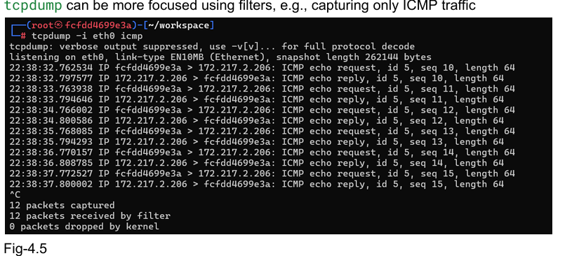
*Fig-4.5 Tcpdump filtered to only show ICMP packets*

---

### 5️⃣ Packet Analysis using Wireshark

Imported the `.pcap` file into Wireshark to analyze captured ICMP packets.

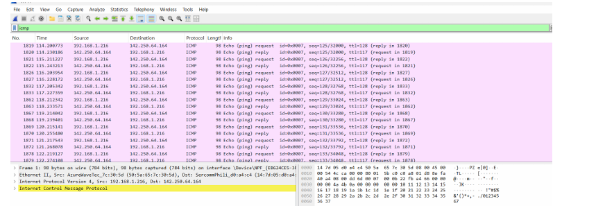
*Fig-5.1 Wireshark showing ICMP echo requests and replies*

---

### 6️⃣ Connectivity Verification Across Systems

Cross-checked reachability between Windows host and container network.

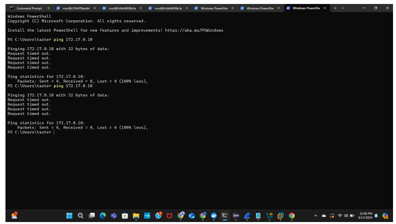
*Fig-5.2 Windows PowerShell showing unreachable Docker network*

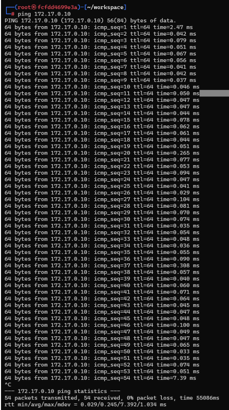
*Fig-5.3 Kali container confirming successful ICMP response*

---

### 7️⃣ ICMP Flood Simulation using Scapy

Created a Python script to send a **controlled ICMP flood** to test packet generation and capture.

```python
from scapy.all import *
import time

target_ip = "192.168.1.100"
packet = IP(dst=target_ip)/ICMP()

for i in range(1000):
    send(packet, verbose=True)
    time.sleep(0.1)
```

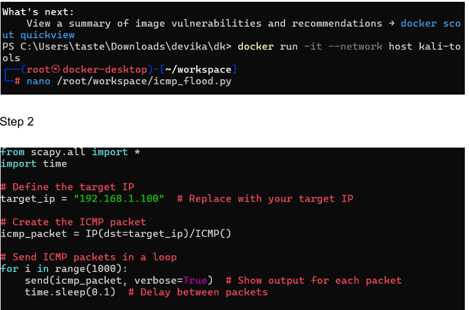
*Fig-7.1 Scapy ICMP flood script creation*

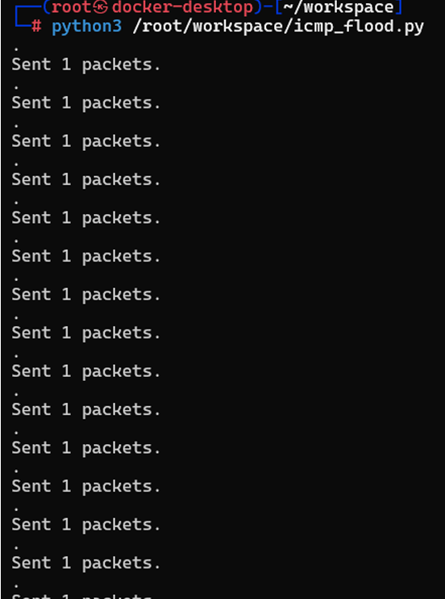
*Fig-7.2 Continuous packet transmission log*

---

## 📊 Concepts & Key Learnings

| Concept                      | Insight                                                      |
| ---------------------------- | ------------------------------------------------------------ |
| **Port Scanning**            | Detected open, closed, and filtered ports using Nmap         |
| **Socket Monitoring**        | Used Netstat and Netcat to visualize and manage TCP sessions |
| **Packet Capture**           | Recorded ICMP and TCP packets using Tcpdump filters          |
| **Traffic Analysis**         | Inspected packet layers and TTL fields in Wireshark          |
| **Custom Packet Generation** | Learned to simulate ICMP traffic with Scapy                  |
| **Forensic Tracing**         | Understood packet direction, timing, and payload structure   |
| **Isolated Testing**         | Used Docker for secure experimentation without host exposure |

---

## 🧠 Summary

This lab successfully demonstrated a **complete reconnaissance-to-analysis workflow**, combining
`Nmap → Netstat/Netcat → Tcpdump → Wireshark → Scapy`.
Each step reinforced critical cybersecurity concepts like **network visibility**, **protocol inspection**, and **traffic forensics** — essential for both penetration testing and incident analysis.

---

## 🧑‍💻 Author

**Devika Kishor**
Master’s Student in Cybersecurity, Florida Institute of Technology

```


/ WebGoat XSS & SQL Injection** project — so it looks equally polished and consistent?
```
